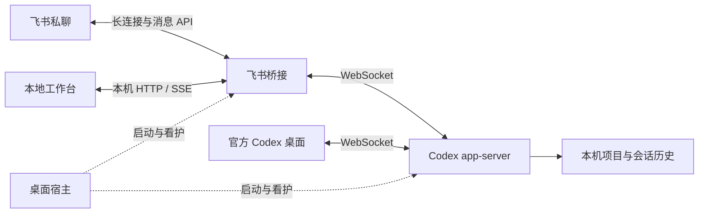

# 架构说明

Feishu Codex 让 Windows Codex 桌面与飞书桥接连接同一个本机 app-server，从而接续同一条会话。工作台呈现项目、会话、进度和连接状态。

## 模块

| 目录 / 文件 | 职责 |
| --- | --- |
| `ui/` | React / TypeScript / Vite 工作台 |
| `desktop/main.mjs`、`preload.cjs` | Electron 窗口、托盘和限定的本机操作 |
| `desktop/host.mjs` | 按需启动宿主、组件看护、桌面身份识别与写入限制 |
| `src/server.ts` | 回环 HTTP API、SSE、静态资源和请求校验 |
| `src/bridge.ts`、`store.ts` | 授权、会话绑定、消息快照、去重和通知 |
| `src/codex.ts`、`codex-websocket.ts` | Codex 协议适配、开始 / 续聊 / 补充 / 停止与事件订阅 |
| `src/discovery.ts` | 只读发现本机项目和 Codex 历史 |
| `src/feishu.ts` | 飞书 SDK 连接、卡片、附件与表情反馈 |
| `src/notify-mcp.ts`、`skills/feishu-codex/` | 按需通知、成品发送与模型使用说明 |
| `src/desktop-tools-relay.ts` | 将共享进程中的桌面工具请求转发至正确的桌面端点 |
| `scripts/desktop-*.ps1` | Windows 启动、退出、进程归属校验和数据维护 |
| `test/` | 协议、会话归属、通知、生命周期与 UI 回归测试 |

桌面构建使用 `build/ui` 作为前端资源目录。

## 会话与轮次归属

飞书聊天与明确选择的项目 / 线程绑定。消息到达时记录绑定快照，处理中切换会话不会把旧消息送到新线程，也不会停止旧任务。

共享连接按 `threadId`、`turnId` 和 `clientUserMessageId` 关联轮次。运行中补充要求使用 `turn/steer`；停止针对所选任务。协议没有原子的“仅当仍空闲才开始”操作，因此桌面先发起任务时，飞书消息可能补充到该轮次；桥接报告实际结果，不自动重试。

历史预览使用只读查询。后台监听遵循桌面归属限制，只为已加载的线程订阅；不会为了看历史而恢复一个未加载的线程、抢占独立桌面的写入权。

## 连接与失败处理

官方桌面启动时，仅为该次进程设置外部 app-server 地址，不永久写入用户环境变量。独立桌面存在、身份不明、后台未就绪或正在退出时暂停飞书写入。用户确认切换模式后，才关闭并重新打开相关桌面。

宿主根据 PID、创建时间、可执行路径与监听端口核验进程身份。已退出的自有组件可有界重启；仍存活但异常的组件不会被直接当作可杀进程。发送后断线属于结果不确定，不自动重放用户指令，也不切到另一个执行后端重跑。

管理 API 只监听回环地址；写请求需要本机随机令牌。渲染页面没有 Node.js 权限。Codex 执行任务的权限与页面隔离是不同的边界，见 [SECURITY.md](SECURITY.md)。

## 回复与通知

- 飞书轮次更新进度卡片，结束时另发结果卡片，使飞书有机会触发新消息通知。
- 桌面自动通知由桥接监听任务结束事件触发，可全局关闭或按持续时间过滤。
- 明确要求“做完通知我”时，模型调用内置 MCP 登记本轮通知，结束后发送。
- 同一轮自动通知和显式通知合并；飞书轮次沿用正常回复，避免重复。
- 卡片带会话上下文，切换按钮只在点击后改变飞书绑定。

## 兼容性边界

Codex 协议参考 [官方 app-server 文档](https://learn.chatgpt.com/docs/app-server)。Windows 商店版单次启动使用包上下文启动路径，其中的系统诊断接口及 Codex 外部共享地址都不是本项目能保证长期稳定的官方扩展契约。客户端更新后需按 [验收清单](docs/testing.md) 复测。
