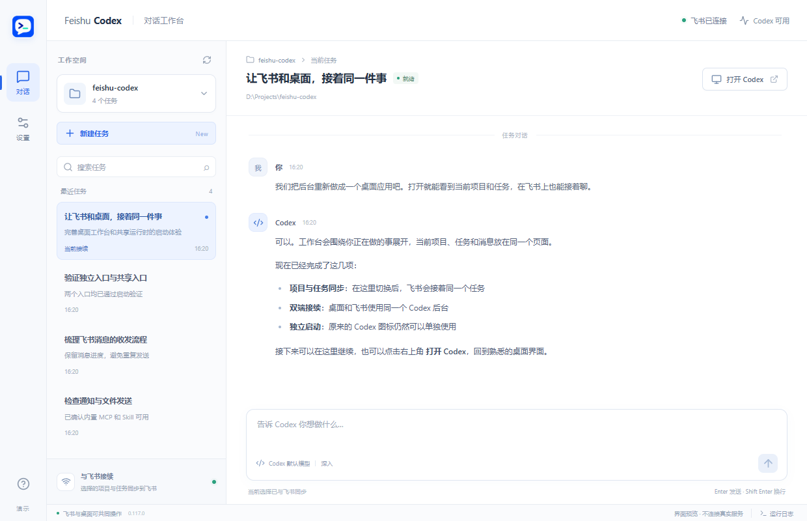
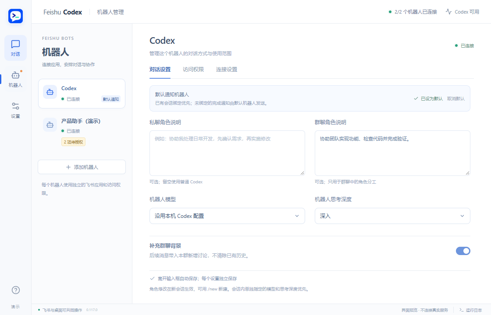

<div align="center">
  
  <h1>Feishu Codex</h1>
  <p><strong>电脑上开始，飞书里继续。</strong></p>
  <p>在 Windows Codex 桌面与手机飞书之间，接着处理同一个会话。</p>
  <p>
    <a href="LICENSE"></a>
    
    <a href="https://github.com/xinyu68/feishu-codex/actions/workflows/ci.yml"></a>
  </p>
  <p>
    <a href="https://github.com/xinyu68/feishu-codex/releases/latest">下载 Windows 安装包</a> ·
    <a href="docs/getting-started.md">配置指南</a> ·
    <a href="docs/usage.md">使用帮助</a> ·
    <a href="docs/development.md">源码构建</a> ·
    <a href="https://github.com/xinyu68/feishu-codex/issues">问题反馈</a>
  </p>
</div>

---

你在电脑上让 Codex 开发功能，离开电脑后，可以在飞书查看结果、补充要求、继续同一个任务。项目、会话历史和本机工作目录保持连续，无需把背景重新讲一遍。

Feishu Codex 是一个本地 Windows 应用，围绕 **桌面与手机接续工作** 设计：打开应用、连接自己的飞书机器人，再从应用打开 Codex，即可开始。

> Continue the same Codex conversation between your Windows desktop and Feishu. Local-first, with a focused workspace, progress cards, and completion notifications.

## 界面预览



<details>
<summary>查看机器人管理</summary>



</details>

以上界面使用演示数据。

## 你可以做什么

| 能力 | 使用场景 |
| --- | --- |
| **同一会话，双端接续** | 桌面开始任务，在飞书继续提问、补充要求或停止当前任务 |
| **项目与历史会话选择** | 用 `/project`、`/session` 找到本机项目和任务，随时切换 |
| **清楚的运行状态** | 在工作台查看历史和最近进度；飞书处理进度默认开启 |
| **完成后通知手机** | 默认通知耗时超过 1 分钟的桌面任务，也可说“做完飞书通知我”单独指定 |
| **指定成品发送** | 按需将图片、报告等成品发到飞书 |
| **沿用本机 Codex** | 使用已有登录、模型配置、项目和 Skills；内置 Skill 与 MCP 自动配置 |
| **Windows 桌面体验** | 托盘、可选开机启动、文件夹选择、自动保存偏好和卸载清理选项 |
| **群聊角色协作** | 手动 @产品、开发、测试等角色，独立会话；可安排完成后交给另一角色继续 |
| **Codex 与 Hermes 协作** | 为机器人选择本机执行端；咨询另一角色后继续当前任务，提问与答复在群里可见 |
| **连续咨询** | 同一组群会话保留独立的咨询历史；连续追问可接着上次答案，不混入双方完整聊天记录 |
| **应用内更新** | 在设置中检查、下载安装新版本，安装前检查正在运行的任务 |

## 开始使用

1. 在 Windows x64 上安装并登录官方 Codex，确认它能独立使用。
2. 在 [Releases](https://github.com/xinyu68/feishu-codex/releases/latest) 下载最新的 `Feishu-Codex-版本号-Setup.exe`，双击安装。
3. 在 [飞书开放平台](https://open.feishu.cn/app) 创建自建应用，启用机器人与长连接事件。完整步骤见 [配置指南](docs/getting-started.md)。
4. 在应用“机器人 → 连接设置”填入 App ID 和 App Secret，验证成功后自动连接。
5. 私聊机器人，再在“访问权限”中允许自己的账号。通过 `/project` 和 `/session` 选择要继续的工作。

应用默认在启动时一起打开 Codex，也可以关闭自动打开，只通过飞书使用。使用原来的 Codex 图标独立启动时，飞书写入会暂停；在工作台点击“连接飞书”，确认重启后即可恢复双端接续。

## 常用命令

| 命令 | 用途 |
| --- | --- |
| `/project` | 选择本机项目 |
| `/session` | 选择当前项目的历史会话 |
| `/new` | 新建会话 |
| `/stop` | 停止当前选中的任务 |
| `/model`、`/effort` | 设置模型与推理强度 |
| `/status` | 查看当前项目、会话与运行状态 |
| `/usage` | 查看账号套餐余量（需要对应账号能力） |
| `/help` | 查看帮助 |

普通工作要求直接发消息即可。切换会话不会自动停止旧任务；收到通知也不会自动切换飞书会话，点击卡片上的“切换到此会话”后才切换。

群聊中先 @目标机器人，再发送要求或命令。没有 @的普通发言不会触发回复；你可以安排机器人完成后交给另一角色继续。多机器人配置、群聊授权与交接规则见 [群聊协作指南](docs/group-collaboration.md)。

也可以同时 @多个机器人使用 `/new`、`/status`、`/stop` 或 `/session`，各自处理自己的会话。选择历史会话时，每张卡片仅切换对应机器人。

需要 Hermes 时，添加机器人时选择 Hermes，并先安装 Hermes、配置好模型。创建后 AI 类型不可更换，如需更换请删除后重新添加。应用自动管理 Hermes 对话服务，无需保持 Hermes 桌面窗口打开。桥接自动配置所需 Skill 与群聊协作 MCP；Hermes 的模型在 Hermes 中设置。飞书连接成功只代表机器人在线，处理消息还需要本机执行端可用。桌面与手机接续同一 Codex 会话的能力继续保留。

## 使用前了解

- **运行权限**：Codex 以当前 Windows 用户身份执行任务，默认完整本机权限、不启用 Codex 沙箱、不等待执行审批。只授权可信的飞书账号，详见 [安全说明](SECURITY.md)。
- **在线条件**：电脑需要保持开机，应用与飞书连接需要运行；睡眠或断网期间不能保证即时处理与通知。
- **兼容范围**：目前支持 Windows x64，已在 Microsoft Store 版 Codex 上验证。桌面接续依赖 Codex 的外部 app-server 连接及 Windows 包上下文启动能力，官方客户端升级后需要复测。
- **数据归属**：配置保存在本机。卸载可选清除应用数据；Codex 账号、历史和项目文件保留。原 Codex 独立入口仍可使用。

Feishu Codex 是独立开源项目，与 OpenAI、飞书及其所属公司无隶属或官方合作关系。

## 开发

技术栈：**Electron · React · TypeScript · Node.js · Codex app-server · 飞书官方 SDK**。

```powershell
git clone https://github.com/xinyu68/feishu-codex.git
cd feishu-codex
npm ci
npm run typecheck
npm test
npm run build
npm run test:ui
npm run package:win
```

开发需要 Windows x64、Node.js 22.13+（建议 Node.js 24）及 Microsoft Edge。安装包自带 Node.js，普通用户无需额外安装。

| 文档 | 内容 |
| --- | --- |
| [配置指南](docs/getting-started.md) | 飞书应用、事件、权限和首次连接 |
| [使用帮助](docs/usage.md) | 双端操作、通知、文件与常见问题 |
| [开发指南](docs/development.md) | 隔离开发、测试和 Windows 打包 |
| [架构说明](DESIGN.md) | 服务边界、线程归属和消息流程 |
| [验收清单](docs/testing.md) | 安装、重装、升级、卸载与双端回归 |
| [更新记录](CHANGELOG.md) | 当前版本功能和修复 |

欢迎通过 [Issue](https://github.com/xinyu68/feishu-codex/issues) 或 Pull Request 参与，提交前请阅读 [贡献指南](CONTRIBUTING.md)。

## 许可证与致谢

采用 [MIT License](LICENSE) 开源。感谢 [Codex Channel Bridge](https://github.com/lsiten/codex-channel-bridge) 为飞书适配与 Codex 集成提供参考；相关版权声明保留在许可证中，详见 [NOTICE.md](NOTICE.md)。
